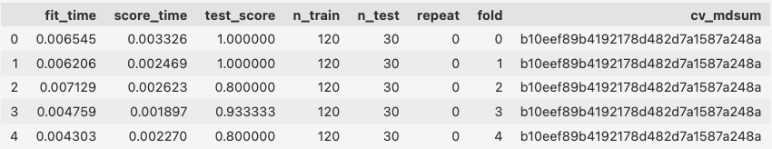
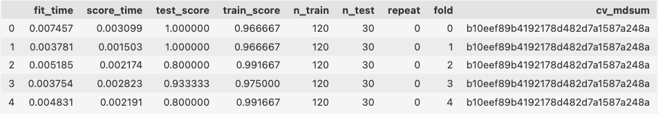
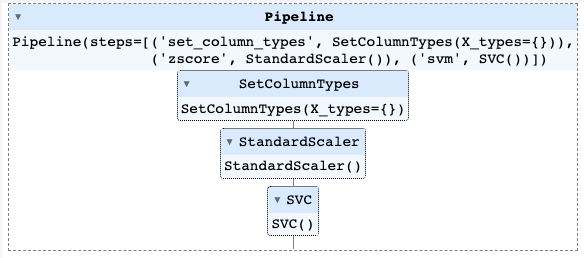
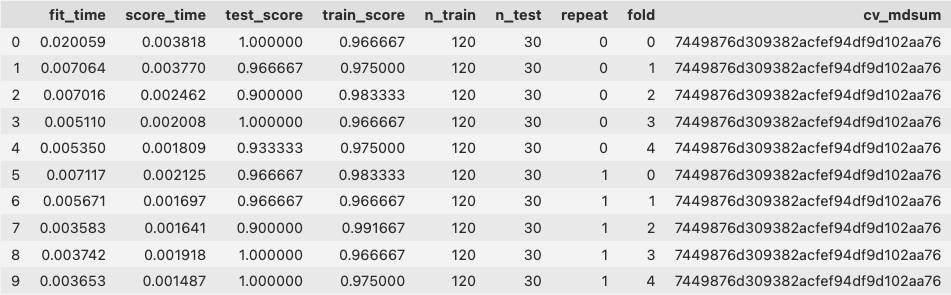
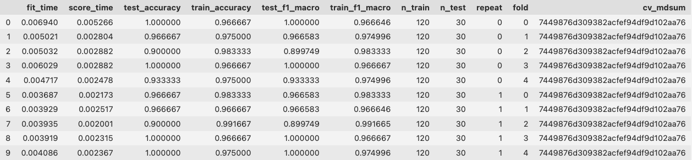
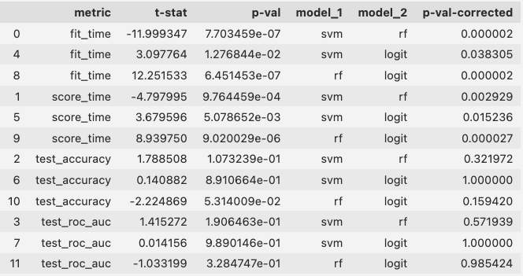

.. include:: ../links.inc

.. _model_evaluation_usage:

Model evaluation
================

The returns of :func:`.run_cross_validation`
--------------------------------------------

So far, we saw how to run a cross-validation using the :class:`.PipelineCreator`
and :func:`.run_cross_validation`. But what do we get as output from such a 
pipeline?

Cross-validation scores
^^^^^^^^^^^^^^^^^^^^^^^

We consider the _iris_ data example and one of the pipelines from the previous 
section (feature z-scoring and a ``svm``). However, this time we assign
the returned value of 
:func:`.run_cross_validation` to a variable called ``scores``. 

.. code-block:: python

    from julearn.model_selection import run_cross_validation
    from julearn.pipeline import PipelineCreator

    # create pipeline
    creator = PipelineCreator(problem_type="classification")
    creator.add("zscore")
    creator.add("svm")

    # run cross-validation
    scores = run_cross_validation(
        X=X,
        y=y,
        data=df,
        model=creator,
    )

The ``scores`` variable is an ExtendedDataFrame object which contains as rows 
the folds (and/or repititions) of the cross-validation and as columns the 
information about the scoring for each fold.

We can for example see that there is ``n_train=120`` samples in each fold's 
training set and ``n_test=30`` samples in each respective validations set. 
Additionally, we see that for example the ``test_score`` for the third fold is 
0.933. This means that the model achieved a score of 0.933 on the validation set
of this fold.

Cross-validation is particularly useful to inspect if a model is overfitting. 
For this purpose it is useful to not only see the test scores for each fold but
also the training scores. This can be achieved by setting the 
``return_train_score`` parameter to ``True`` in :func:`.run_cross_validation`:

.. code-block:: python

    scores = run_cross_validation(
        X=X,
        y=y,
        data=df,
        model=creator,
        return_train_score=True,
    )

Leading to an additional column ``train_score`` in the ``scores`` variable:

For a model that is not overfitting, the training and test scores should be 
similar. In our example, the training and test scores are indeed similar.

The column ``cv_mdsum`` on the first glance might appear a bit cryptic. However, 
it can be useful for internal checks, to see if the same CV was used or not. But
this is nothing you need to worry about at this point.

Returning a model (estimator)
^^^^^^^^^^^^^^^^^^^^^^^^^^^^^^^^^^^^

Now that we saw that our model doesn't seem to overfit, we might be interested 
in not only the scores but also want to return a model. For that purpose 
:func:`.run_cross_validation` has the parameter ``return_estimator``. It can 
have three different values:

1. ``"cv"``: This will lead to :func:`.run_cross_validation` returning all the 
estimators from each CV fold, fitted on the training data of the respective 
fold, i.e. the models that led to the above scores in each fold.

2. ``"final"``: With this setting, an additional model will be trained on the 
entire training dataset and not on the cv folds. This model will be returned. 
The scores will still refer to the cv folds.

1. ``"all"``: In this scenario, all the estimators (final and cv) will be 
returned.

For demonstration purposes we will have a closer look at the ``"final"``
estimator option (same pipeline as above) and therefore assign the returned 
values of :func:`.run_cross_validation` to a variable called ``scores`` (for 
the CV scores) and ``model`` (for the returned model):

.. code-block:: python

    scores, model = run_cross_validation(
        X=X,
        y=y,
        data=df,
        model=creator,
        return_train_score=True,
        return_estimator="final",
    )

``scores`` will contain the same content as before. The ``model`` variable 
is a sklearn estimator object and has all the information on our pipeline and 
the retrained information on the entire training dataset.

  

We can use this estimator object to for example inspect the coefficients of the 
model or make predictions on a hold out test set. To learn more about how to
inspect models please have a look at :ref:`model_inspection`.

Cross-validation types and scoring
----------------------------------

Cross-validation splitters
^^^^^^^^^^^^^^^^^^^^^^^^^^
When performing a cross-validation, we need to split the data into training and
validation sets. This is done by a cross-validation splitter, that defines how 
many folds should be used, how often the cross-validation should be repeated
and how the data should be split. When splitting the data they can for example 
be shuffled, one can consider certain groups for splitting or the splits can be 
stratified according to some pre-defined variables.

So far, however, we didn't specify anything in that regard and still the cross-
validation was performed and we got five folds (see the five rows above in the 
scores dataframe). This is, because per default :func:`.run_cross_validation` 
falls back to the scikit-learn defaults, which is a `StratifiedKFold`_ (k=5) for 
classification and `KFold`_ (k=5) for regression. So in our case a `KFold`_ 
cross-validation with five folds was performed.

.. note::
  These defaults will change when they are changed in scikit-learn as here 
  Julearn just falls back to the scikit-learn defaults.

We can define the cross-validation splitting strategy ourselves by passing an 
int, str or cross-validation generator to the ``cv`` parameter of 
:func:`.run_cross_validation`. The default described above resembles ``cv=None``.
the second options is to pass only an integer to ``cv``. In that case still the 
same default splitting
strategies will be used (`StratifiedKFold`_ for classification, 
`KFold`_ for regression), but the number of folds will be changed to the value 
of the provided integer (e.g. ``cv=10``). To define the entire splitting 
strategy, one can pass all scikit-learn compatible splitters [#1]_
to ``cv``. However, Julearn provides a built-in set of possible splitters that 
can be found under :ref:`model_selection` (see more about them in 
:ref:`cv_splitter`). The fourth option is to pass an 
iterable that yields the train and test indices for each split.

Using the same pipeline (``creator``) as above, we can define a cv-splitter and
pass it to :func:`.run_cross_validation` as follows:

.. code-block:: python

    from sklearn.model_selection import RepeatedStratifiedKFold

    cv_splitter = RepeatedStratifiedKFold(n_splits=5, n_repeats=2, random_state=42)

    scores = run_cross_validation(
        X=X,
        y=y,
        data=df,
        model=creator,
        cv=cv_splitter,
        return_train_score=True,
    )

This will lead to a cross-validation being performed 10 times 
(5 folds x 2 repeats), so the returned ``scores`` dataframe will have 10 rows 
now. We set the ``random_state`` to an arbitrary integer to make the splitting
of the data reproducible.

Scoring
^^^^^^^
Nice, we have a basic pipeline, with preprocessing of features and a model, we
defined the splitting strategy for the cross-validation the way we want it and we
had a look at our resulting train and test scores when performing 
the cross-validation. But what do these scores even mean?

Same as for the kind of cv-splitter, :func:`.run_cross_validation` has a default 
assumption for the scorer to be used to evaluate the cross-validation, which is
always the model's default scorer. Remember, we used a support vector classifier
with the ``y`` (target) variable being the species of the iris dataset
(possible values: 'setosa', 'versicolor' or 'virginica'). Therefore we have a
multi-class classification (not to be confused with a multi-label 
classification!). Checking the scikit-learn documentation of a support vector 
classifier's default scorer, we can see that this is the 
'mean accuracy on the given test data and labels' [#2]_.

With the ``scoring`` parameter of :func:`.run_cross_validation`, one can define
the scoring function to be used. On top of the available scikit-learn `scoring`_
parameter options, julearn extends the 
functionality with more internal scorers and the possibility to define custom
scorers. To see the available Julearn scorers, one can use the 
:func:`.list_scorers` function:

.. code-block:: python

    from julearn import scoring

    scoring.list_scorers()

To use a Julearn scorer, one can pass the name of the scorer as a string to the 
``scoring`` parameter of :func:`.run_cross_validation`. If multiple different 
scorers should be used, a list of strings can be passed. For example, if we were
interested in the ``accuracy`` and the ``f1`` as scorer we could do the
following:

.. code-block:: python

    scoring = ["accuracy", "f1_macro"]

    scores = run_cross_validation(
        X=X,
        y=y,
        data=df,
        model=creator,
        cv=cv_splitter,
        return_train_score=True,
        scoring=scoring,
    )

The ``scores`` dataframe will now have train- and test-score columns for both
scorers:

.. # TODO?
.. Additionally, julearn allows the user to define and register any function and 
.. use it as a scorer in the same way scikit-learn or julearn internal scorers work.

..  <add code example?>

Basic model comparisons with Julearn
------------------------------------

The example model seems to perform decently well. But what if we want to compare
the performance of different models, for example when using different learning 
algorithms? 

To statistically compare different models, Julearn provides a built-in 
corrected t-test. To see how to apply it, we will first build three different 
models, each with another learning algorithm and then statistically compare them.

To perform a binary classification (and not a multi-class classification) we 
will switch to the ``breast_cancer`` dataset from scikit-learn [#3]_ as an
example. The to be predicted target states if the cancer is malignant or benign.

.. code-block:: python

    from sklearn.datasets import load_breast_cancer

    data = load_breast_cancer()
    df = pd.DataFrame(data.data, columns=data.feature_names)
    df["target"] = data.target

    X = df.iloc[:,:-1].columns.tolist()
    y = "target"

We start by defining the same cv_splitter as above and two scorers:

.. code-block:: python

    cv_splitter = RepeatedStratifiedKFold(n_splits=5, n_repeats=2, random_state=42)

    scoring = ["accuracy", "roc_auc"]

We will use the same pipeline as above, but this time without the 
:class:`.PipelineCreator` and instead define the pipeline directly in 
:func:`.run_cross_validation`. We use three different learning algorithms that 
we want to compare and use the default hyperparameters for each of them.

**Model 1**: default SVM.

.. code-block:: python

  scores1 = run_cross_validation(
      X=X,
      y=y,
      data=df,
      model="svm",
      preprocess="zscore",
      problem_type="classification",
      scoring=scoring,
      cv=cv_splitter,
  )

**Model 2**: default Random Forest.

As we can see in :ref:`available_models`, we can specify to use a random forest
by passing the ``rf`` string to the ``model`` parameter of 
:func:`.run_cross_validation`.

.. code-block:: python
  
  scores2 = run_cross_validation(
      X=X,
      y=y,
      data=df,
      model="rf",
      preprocess="zscore",
      problem_type="classification",
      scoring=scoring,
      cv=cv_splitter,
  )

**Model 3**: default Logistic Regression.

.. code-block:: python
  
  scores3 = run_cross_validation(
      X=X,
      y=y,
      data=df,
      model="logit",
      preprocess="zscore",
      problem_type="classification",
      scoring=scoring,
      cv=cv_splitter,
  )

We will add a column to each scores dataframes to be able to distinguish the 
different models later on.

.. code-block:: python

  scores1["model"] = "svm"
  scores2["model"] = "rf"
  scores3["model"] = "logit"

Comparing the performance of these three models is now as easy as 
the following one-liner:

.. code-block:: python

  from julearn.stats.corrected_ttest import corrected_ttest

  stats_df = corrected_ttest(scores1, scores2, scores3)
  print(stats_df)

This gives us a dataframe with the corrected t-test results for each pairwise 
comparison of the three models' fit_time, score_time and test scores:

We can see, that none of the models performed better with respect to
neither accuracy nor roc_auc. However, the Random Forest was slower than both 
the SVM and the Logistic Regression.

.. # TODO - Add visualization or leave it for the example?
.. To get a better overview of the performance of the three models, we can use the
.. Julearn's visualization tool to plot the scores:

.. from julearn.viz import plot_scores
.. panel = plot_scores(scores1, scores2, scores3)
.. panel.show()

.. topic:: References:

  .. [#1] https://scikit-learn.org/stable/modules/classes.html#module-sklearn.model_selection
  .. [#2] https://scikit-learn.org/stable/modules/generated/sklearn.svm.SVC.html#sklearn.svm.SVC.score
  .. [#3] https://scikit-learn.org/stable/modules/generated/sklearn.datasets.load_breast_cancer.html